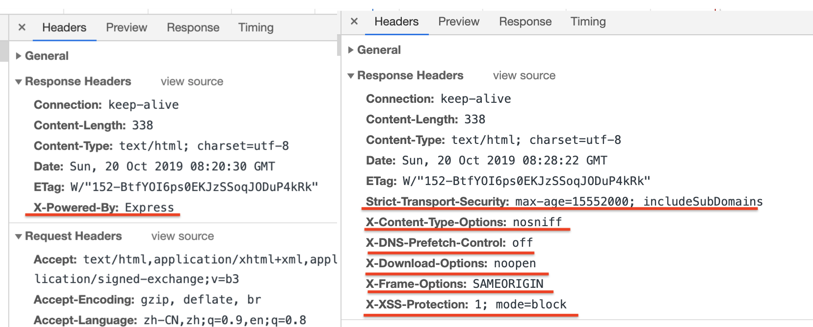

# helmet

helmet是express的一个中间件，可以通过设置http相应头来保护express应用程序




X-: 不是标准的响应头参数

参数名 | 含义
:--:|:--:|:--:
X-Powered-By| 表示是由Express提供，由于不同语言和框架本身有漏洞，所以隐藏掉来保证 
Strict-Transport-Security|[MDN](https://developer.mozilla.org/zh-CN/docs/Security/HTTP_Strict_Transport_Security) HTTP Strict Transport Security（通常简称为HSTS）是一个安全功能，它告诉浏览器只能通过HTTPS访问当前资源，而不是HTTP  [www.antfin.com](http://www.antfin.com)
X-Content-Type-Options|  服务器用来提示客户端一定要遵循在 Content-Type 首部中对  MIME 类型 的设定，而不能对其进行修改。这就禁用了客户端的 MIME 类型嗅探行为  [嗅探](#jump) [Content-Type](#contenttype) [MDN](https://developer.mozilla.org/zh-CN/docs/Web/HTTP/Headers/X-Content-Type-Options)
X-DNS-Prefetch-Control | DNS 预解析 [插件解析](https://helmetjs.github.io/docs/dns-prefetch-control/) 在一定程度上可以提高访问资源时的加载速度，但是也在一定程度上造成隐私隐患，所以可以开启也可以关闭，默认为关闭
X-Download-Options | 不打开文件，变为下载
X-Frame-Options | [MDN](https://developer.mozilla.org/zh-CN/docs/Web/HTTP/X-Frame-Options) 用来给浏览器指示允许一个页面 可否在 ```<frame>, <iframe>, <embed> 或者 <object> ```中展现的标记。站点可以通过确保网站没有被嵌入到别人的站点里面，从而避免 clickjacking 攻击。
X-XSS-Protection | [MDN](https://developer.mozilla.org/zh-CN/docs/Web/HTTP/Headers/X-XSS-Protection) 当检测到跨站脚本攻击 (XSS)时，浏览器将停止加载页面。虽然这些保护在现代浏览器中基本上是不必要的，当网站实施一个强大的Content-Security-Policy来禁用内联的JavaScript ('unsafe-inline')时, 他们仍然可以为尚不支持 CSP 的旧版浏览器的用户提供保护

## code

```js
app.use(helmet({
  frameguard: {
    action: 'deny'
  }
}))
```

## 文档

| 模块 | 是否默认开启 | 说明
|---|---| --- |
| [contentSecurityPolicy](https://helmetjs.github.io/docs/csp/) for setting Content Security Policy |  | 设置Content-Security-Policy 可以帮助防止恶意注入JavaScript，CSS，插件等
| [crossdomain](https://helmetjs.github.io/docs/crossdomain/) for handling Adobe products' crossdomain requests |  | 可防止Adobe Flash和Adobe Acrobat在您的网站上加载内容。
| [dnsPrefetchControl](https://helmetjs.github.io/docs/dns-prefetch-control) controls browser DNS prefetching | ✓ | X-DNS-Prefetch-Control DNS 预解析
| [expectCt](https://helmetjs.github.io/docs/expect-ct/) for handling Certificate Transparency |  | [expectCt草案](https://httpwg.org/http-extensions/expect-ct.html) [expect-ct](https://scotthelme.co.uk/a-new-security-header-expect-ct/) Chrome浏览器在2017年10月及以后发布的所有证书都必须记录在CT日志中，如果此参数被开启，将会对证书进行白名单校验  [证书透明](https://scotthelme.co.uk/certificate-transparency-an-introduction/)
| [featurePolicy](https://helmetjs.github.io/docs/feature-policy/) to limit your site's features |  | 浏览器特征API的限制、如全屏 震动 支付
| [frameguard](https://helmetjs.github.io/docs/frameguard/) to prevent clickjacking | ✓ | X-Frame-Options  设置本网站是否可以被iframe嵌套
| [hidePoweredBy](https://helmetjs.github.io/docs/hide-powered-by) to remove the X-Powered-By header | ✓ | X-Powered-By 隐藏
| [hpkp](https://helmetjs.github.io/docs/hpkp/) for HTTP Public Key Pinning |  |  被弃用
| [hsts](https://helmetjs.github.io/docs/hsts/) for HTTP Strict Transport Security | ✓ | Strict-Transport-Security 设置https
| [ieNoOpen](https://helmetjs.github.io/docs/ienoopen) sets X-Download-Options for IE8+ | ✓ |  X-Download-Options 防止Internet Explorer执行下载
| [noCache](https://helmetjs.github.io/docs/nocache/) to disable client-side caching |  | 禁止浏览器缓存  [参数说明](#nocache) 
| [noSniff](https://helmetjs.github.io/docs/dont-sniff-mimetype) to keep clients from sniffing the MIME type | ✓ | 设置 X-Content-Type-Options
| [referrerPolicy](https://helmetjs.github.io/docs/referrer-policy) to hide the Referer header |  | Referrer-Policy 控制浏览器头部是否带Referer参数
| [xssFilter](https://helmetjs.github.io/docs/xss-filter) adds some small XSS protections | ✓ | 设置 X-XSS-Protection 


## 其他


### <span id = "contenttype">Content-Type</span>

Content-Type 实体头部用于指示资源的MIME类型 media type 。

在响应中，Content-Type标头告诉客户端实际返回的内容的内容类型。浏览器会在某些情况下进行MIME查找，并不一定遵循此标题的值; 为了防止这种行为，可以将标题 X-Content-Type-Options 设置为 nosniff。


MIME(Multipurpose Internet Mail Extension)类型是一种表示文档的性质和格式的标准化方法。在浏览器中使用MIME类型来告诉服务器确定如何处理文档数据和显示文档，而不是通过文件扩展名。


[完整的MIME列表](https://www.iana.org/assignments/media-types/media-types.xhtml)


### <span id = "jump">嗅探</span>

在浏览器（主要为IE）认为文件的MIME类型错误或者没有设置时自动设置正确的MIME类型。

[Headers](https://cloud.tencent.com/developer/chapter/13542)


### <span id="nocache">nocache 参数</span>
```
Cache-Control: no-store, no-cache, must-revalidate, proxy-revalidate
Pragma: no-cache
Expires: 0
Surrogate-Control: no-store
```